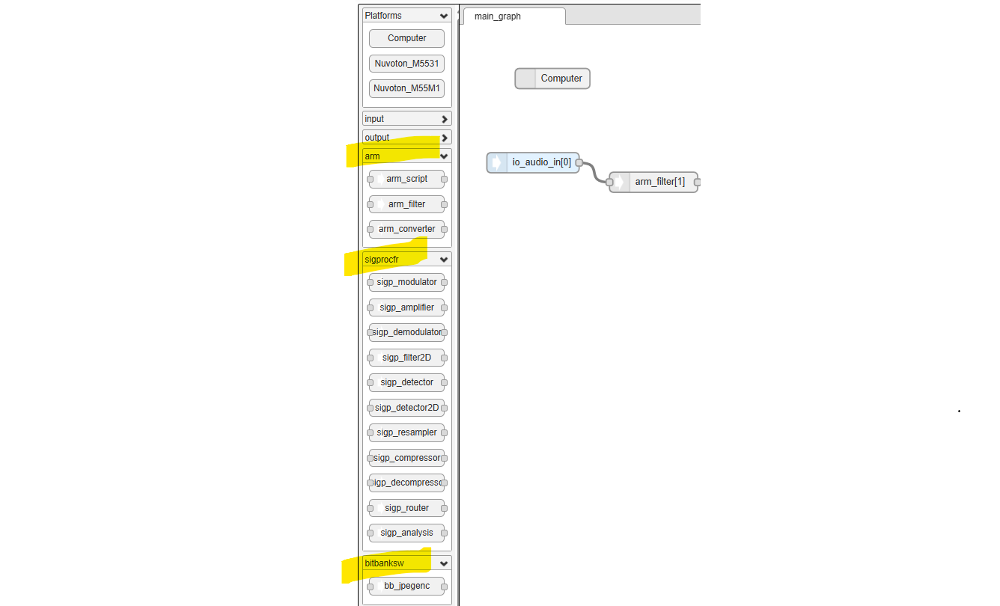
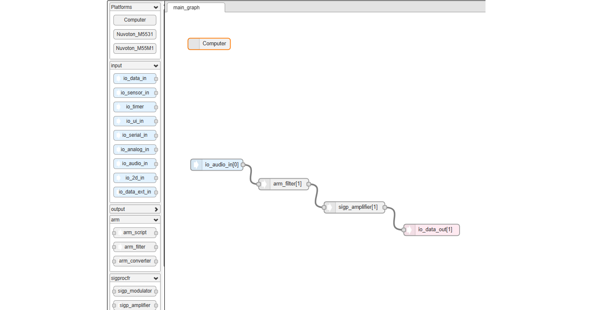
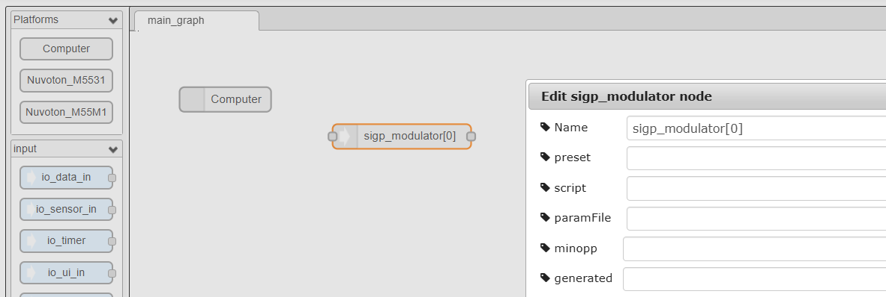
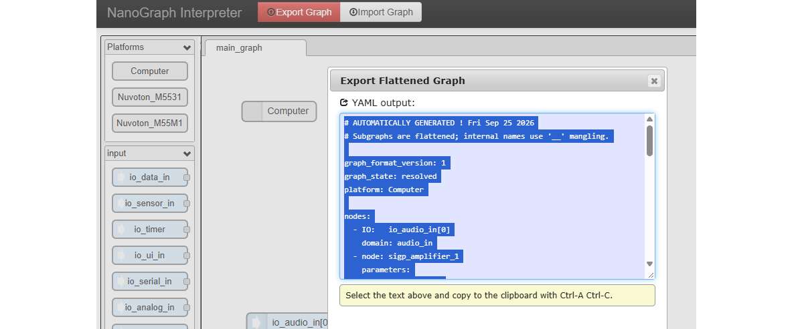

# NanoGraph GUI User Guide

This guide explains how to use the **NanoGraph GUI** from scratch to build, inspect, export, modify, and re-import a processing graph.

The GUI is intended to let a system integrator describe a stream-processing application graphically while NanoGraph takes care of platform-specific details such as supported I/O formats, sample rates, channel counts, FIFO sizes, and automatic format conversion.

> **Key idea:** the graph describes the application you want. The **platform manifest** and **node manifests** describe what the selected hardware and software components can do. During export, NanoGraph resolves the two together.

---

## Table of contents

- [1. Start the GUI](#1-start-the-gui)
- [2. Understand the workspace](#2-understand-the-workspace)
- [3. Create your first graph](#3-create-your-first-graph)
- [4. Select the target platform](#4-select-the-target-platform)
- [5. Add input and output interfaces](#5-add-input-and-output-interfaces)
- [6. Add processing nodes](#6-add-processing-nodes)
- [7. Connect the graph](#7-connect-the-graph)
- [8. Edit node and I/O properties](#8-edit-node-and-io-properties)
- [9. Inspect manifests in the Info panel](#9-inspect-manifests-in-the-info-panel)
- [10. How format resolution works](#10-how-format-resolution-works)
- [11. Automatic `arm_converter` insertion](#11-automatic-arm_converter-insertion)
- [12. Export the graph](#12-export-the-graph)
- [13. Import a graph](#13-import-a-graph)
- [14. Generated versus manually added converters](#14-generated-versus-manually-added-converters)
- [15. Re-target the same graph to another platform](#15-re-target-the-same-graph-to-another-platform)
- [16. Practical workflow](#16-practical-workflow)
- [17. Troubleshooting](#17-troubleshooting)
- [18. Terminology](#18-terminology)

---

## 1. Start the GUI

1. Unpack the NanoGraph GUI project directory.
2. Open `GUI.html` in a web browser.
3. The GUI runs locally; no NanoGraph target needs to be connected in order to design a graph.

The project already contains:

- platform manifests in `platforms/`
- node manifests in `manifests/`
- the generated JavaScript manifest databases used by the GUI
- the graph editor and format resolver

The current reference package contains these example platforms:

- `Computer`
- `Nuvoton_M5531`
- `Nuvoton_M55M1`

---

## 2. Understand the workspace

The main window contains three important areas:

1. **Palette** — available platforms, I/O interfaces, and processing nodes.
2. **Workspace** — where the graph is assembled by connecting nodes.
3. **Info panel** — information about the selected item, including data read from its manifest.

The processing-node palette is grouped by node provider/developer.



A graph is built by connecting input interfaces to processing nodes and processing nodes to output interfaces.



> The screenshot above is an older example of the workspace. The current GUI also provides **Import Graph** next to **Export Graph**.

---

## 3. Create your first graph

A minimal graph usually contains:

```text
Platform

Input I/O  -->  Processing node  -->  Output I/O
```

For example:

```text
Computer

io_data_in  -->  arm_filter  -->  io_data_out
```

The platform itself is not part of the data stream. It tells NanoGraph which processor, memory, and I/O capabilities are available when the graph is resolved.

---

## 4. Select the target platform

Open the **Platforms** section of the palette and drag one platform onto the workspace.

For example:

```text
Computer
```

or:

```text
Nuvoton_M55M1
```

Only one target platform should describe the graph being exported.

The selected platform manifest defines information such as:

- processors
- memories
- interpreter instances
- available I/O interfaces
- supported data types
- supported sample rates
- supported channel counts
- frame lengths
- I/O protocol behavior
- buffer ownership
- copy/zero-copy behavior
- interface setup time

Examples of platform-I/O implementation fields are:

```yaml
protocol: initiator
malloc: in_graph
set0copy1: copy
setup_time: 0.0125
```

If one of these fields is absent, the platform reader uses the NanoGraph defaults:

```text
protocol   = servant
malloc     = platform
set0copy1  = set
setup_time = 0
```

---

## 5. Add input and output interfaces

Drag the required I/O blocks from the palette onto the workspace.

Examples include:

```text
io_data_in
io_sensor_in
io_audio_in
io_data_out
io_audio_out
io_ui_in
io_ui_out
```

An I/O block in the graph identifies a logical platform interface. During graph resolution, NanoGraph looks up the matching interface in the selected platform manifest.

The platform manifest is therefore the authoritative description of what that I/O can actually support.

### Optional graph-level I/O selections

An I/O node can explicitly constrain fields such as:

- frame length
- sample rate
- number of channels
- data type
- interleaving

Leaving a field empty means that the graph does not impose an additional constraint and the resolver can use the capabilities/defaults from the platform manifest.

For `interleaving`, an empty value means **unspecified**. Explicit values are:

```text
interleaved
deinterleaved
```

---

## 6. Add processing nodes

Processing nodes are grouped in the palette by provider/developer.

Drag the required processing node onto the workspace, for example:

```text
arm_filter
arm_script
sigp_resampler
sigp_detector
```

Each processing node is associated with a **node manifest**. The manifest describes capabilities such as:

- input and output interfaces
- accepted stream formats
- parameters
- implementation language
- processor architecture requirements
- memory requirements
- software/library dependencies

The GUI uses this manifest information when resolving the graph.

---

## 7. Connect the graph

Create an arc by dragging from an output connector of one block to an input connector of another.

For example:

```text
io_audio_in  -->  arm_filter  -->  io_audio_out
```

A node with several inputs or outputs exposes several connection points.

The visual connection represents a **logical stream**. The concrete stream format is resolved later from both endpoint manifests.

---

## 8. Edit node and I/O properties

Double-click a graph item to open its editor.

Depending on the item, you can set instance-specific values such as:

- name
- presets
- algorithm parameters
- external parameter file
- script
- I/O format constraints



The values entered here belong to this **graph instance**. They do not change the original node or platform manifest.

For a node parameter, an explicit graph value overrides the corresponding default for that instance.

---

## 9. Inspect manifests in the Info panel

Select a **platform** or **processing node** in the workspace and open the **Info** panel.

The Properties/Info content is generated from the corresponding manifest.

### For a platform

The panel can show manifest content such as:

```text
Platform
Version
Description
Processors
Memories
Interpreter instances
I/O interfaces
Formats
```

For an I/O interface, this includes fields such as:

```text
direction
protocol
malloc
set0copy1
setup_time
domain
data_type
frame_length
sample_rate
nb_channels
interleaving
```

### For a processing node

The panel can show:

```text
Description
Interfaces
Accepted formats
Parameters
Activation information
Implementation information
Memory banks
Library dependencies
```

This is useful when deciding whether two blocks can be connected directly or whether conversion will be necessary.

> **Manifest = capability. Graph property = instance selection.**

---

## 10. How format resolution works

NanoGraph resolves the stream format of every arc during export.

For each connection, the resolver compares the capabilities of the producer and consumer.

Typical negotiated fields are:

```text
data_type
sample_rate
nb_channels
interleaving
```

`frame_length` is handled separately because it describes processing granularity and is also used for FIFO sizing.

### Example: compatible sample rates

Suppose a node supports:

```yaml
sample_rate:
  default: 16000
  values: [8000, 16000, 44100]
```

and the platform I/O supports:

```yaml
sample_rate:
  default: 44100
  values: [8000, 16000, 44100]
```

The default values are preferences, not mandatory values.

The intersection contains `16000`, so the graph can use:

```text
16000 Hz
```

without inserting a converter.

### Empty fields

An absent or empty format selection normally means **no additional constraint**.

For example, the default GUI value for interleaving is empty:

```text
""
```

The resolver is then free to select an interleaving compatible with both endpoints.

### `same_as`

A node output can declare that its format must be the same as another interface of the same node:

```yaml
format:
  same_as:
    interface: rx_interface
    index: 0
```

This is common for processing nodes that preserve their input format.

---

## 11. Automatic `arm_converter` insertion

If producer and consumer capabilities do not intersect for a convertible format field, NanoGraph can automatically insert an `arm_converter`.

Example:

```text
Platform input: 48000 Hz only
Node input:     16000 Hz only
```

The logical graph is:

```text
io_audio_in  -->  arm_filter
```

The resolved graph becomes:

```text
io_audio_in  -->  arm_converter_0  -->  arm_filter
```

Automatically inserted converters are marked in exported YAML:

```yaml
generated: true
generated_by: format_resolver
generated_reason: sample_rate
```

If several properties require conversion, the reason can contain several fields.

For example:

```yaml
generated_reason: sample_rate,nb_channels
```

### Why the `generated` marker matters

It tells the GUI that the converter is an **implementation artifact** produced by graph resolution rather than part of the user's original logical design.

This becomes important when the graph is imported again or re-targeted to another platform.

---

## 12. Export the graph

When the graph is ready, click **Export Graph**.

The exporter:

1. reads the logical graph
2. loads the selected platform manifest
3. loads the node manifests
4. resolves the endpoint formats
5. inserts converters when required
6. calculates FIFO sizes
7. creates the common format table
8. generates the resolved YAML graph

The resulting YAML begins with metadata similar to:

```yaml
graph_format_version: 1
graph_state: resolved
platform: Computer
```

Resolved stream formats are centralized in a top-level `formats:` section. Arcs reference them using generated `formatID` values.

`formatID` is generated during export; it is not something the GUI user normally edits as a node property.



---

## 13. Import a graph

Click **Import Graph**.

You can either:

- paste YAML into the import dialog, or
- load a `.yaml`, `.yml`, or `.txt` file.

Two import behaviors are available.

### Logical import — recommended

Logical import is the default.

It:

1. reads the exported graph
2. removes nodes explicitly marked `generated: true`
3. reconnects the original logical path through those generated nodes
4. removes resolved `formatID` metadata
5. recreates the logical graph in the GUI

The graph can then be resolved again using the current platform and manifests.

This is the normal mode for editing or re-targeting a graph.

### Preserve resolved graph

Use **Preserve resolved graph** when you need to inspect or reproduce the exact implementation that was exported.

In this mode, generated converters are retained.

This is mainly useful for debugging.

---

## 14. Generated versus manually added converters

NanoGraph deliberately distinguishes between automatically generated and user-authored converters.

### Automatically generated converter

```yaml
- node: arm_converter_0
  generated: true
  generated_by: format_resolver
  generated_reason: sample_rate
```

Logical import is allowed to remove this node and resolve the conversion again.

### Manually added converter

If you deliberately add a converter to the graph, it has no `generated: true` marker:

```yaml
- node: arm_converter_1
```

The importer treats it as part of your design and **does not remove it**.

This also means a YAML graph can be manually edited outside the GUI. If you add a converter intentionally, simply do not mark it as generated.

---

## 15. Re-target the same graph to another platform

One of the main purposes of the manifest-based design is to reuse the same logical graph on different platforms.

For example, the same graph may be used with:

```text
Computer
Nuvoton_M5531
Nuvoton_M55M1
```

The node topology can remain unchanged while each platform advertises different I/O capabilities.

Consider this logical graph:

```text
io_audio_in  -->  arm_filter  -->  io_audio_out
```

### Platform A

If the platform and filter both support `16000 Hz`:

```text
io_audio_in  ----------------->  arm_filter
              16000 Hz
```

No converter is required.

### Platform B

If the platform input supports only `48000 Hz` while the filter requires `16000 Hz`:

```text
io_audio_in  -->  arm_converter  -->  arm_filter
   48000 Hz          |               16000 Hz
                     +-- generated
```

The logical application has not changed. Only its resolved implementation has changed.

### Recommended re-targeting workflow

1. Export the current graph if you want to keep a copy.
2. Import it using **Logical import** if starting from an exported resolved graph.
3. Replace/select the desired platform.
4. Inspect the new platform manifest in **Info**.
5. Export again.
6. Check which converters and resolved formats are now generated.

This separation between **logical graph** and **resolved graph** is particularly useful when many platforms use the same processing nodes.

---

## 16. Practical workflow

A typical NanoGraph development cycle is:

```text
Choose platform
      |
      v
Add I/O + processing nodes
      |
      v
Connect logical graph
      |
      v
Set only the instance constraints you really need
      |
      v
Inspect node/platform manifests in Info
      |
      v
Export Graph
      |
      v
Format resolution + FIFO sizing + generated converters
      |
      v
Resolved YAML
      |
      +-----------------------------+
      |                             |
      v                             v
compile/use graph             edit YAML manually
                                    |
                                    v
                              Import Graph
                                    |
                                    v
                              Logical import
                                    |
                                    v
                              resolve again
```

A useful design rule is:

> **Do not force a format value in the GUI unless the application genuinely requires it.**

Leaving a property unconstrained gives the resolver more freedom to find a direct intersection and avoids unnecessary converters.

---

## 17. Troubleshooting

### Export reports that the platform has no matching interface

Check that the I/O block used in the graph exists in the selected platform manifest.

For example, an `io_audio_in` graph node requires a corresponding platform interface with that logical name/index.

---

### An `arm_converter` appears unexpectedly

Inspect the manifests of both endpoints in the **Info** panel and compare:

```text
data_type
sample_rate
nb_channels
interleaving
```

Also check whether you explicitly forced a value in the I/O or node instance.

Remember that a manifest `default` is a preference when compatible `values` are available; it should not by itself force conversion.

---

### A converter disappears after import

If it was exported with:

```yaml
generated: true
```

and you chose **Logical import**, this is expected. The importer removes resolver-generated implementation nodes so the graph can be resolved again.

If the converter is intentional, add it manually or remove the `generated: true` marker before import.

---

### I want to reproduce exactly what was exported

Use **Import Graph** and select **Preserve resolved graph**.

This retains generated converter nodes.

---

### The graph worked on one platform but changes on another

This is expected when the platform manifests advertise different capabilities.

The logical graph can stay the same while the resolved implementation changes because of:

- sample-rate differences
- data-type differences
- channel-count differences
- interleaving constraints
- different frame lengths
- platform I/O characteristics

---

### I see an empty interleaving value

An empty interleaving value means **unspecified**, not `interleaved`.

Explicit values are:

```text
interleaved
deinterleaved
```

For example, mono streams often do not need an interleaving constraint.

---

## 18. Terminology

| Term | Meaning |
|---|---|
| **Logical graph** | The application topology intentionally created by the user. |
| **Resolved graph** | The platform-specific implementation after format resolution and automatic node insertion. |
| **Platform manifest** | Description of processors, memories, interpreter instances, I/O interfaces, and their capabilities. |
| **Node manifest** | Description of a processing node's interfaces, parameters, implementation, memory needs, and supported formats. |
| **Arc** | A stream connection between two graph endpoints. |
| **Format intersection** | A value supported by both producer and consumer endpoints. |
| **Generated node** | A node added automatically by the resolver and exported with `generated: true`. |
| **User-authored node** | A node deliberately added by the user; it has no `generated: true` marker. |
| **`formatID`** | Export-generated identifier referencing a concrete resolved format from the common format table. |
| **`same_as`** | Manifest relation requiring one node interface to use the negotiated format of another interface. |
| **Logical import** | Import mode that removes generated implementation artifacts and reconstructs the logical graph. |
| **Preserve resolved graph** | Import mode that keeps generated nodes for debugging/reproduction. |

---

## Quick-start checklist

- [ ] Open `GUI.html`.
- [ ] Drag one target platform onto the workspace.
- [ ] Add the required input and output I/O blocks.
- [ ] Add processing nodes.
- [ ] Connect the graph.
- [ ] Set only parameters or format constraints required by the application.
- [ ] Select nodes/platforms and inspect their manifest information in **Info**.
- [ ] Click **Export Graph**.
- [ ] Check automatically generated `arm_converter` nodes if present.
- [ ] Use **Import Graph → Logical import** when you want to edit or re-target an exported graph.
- [ ] Use **Preserve resolved graph** only when you want to reproduce the exact exported implementation.

---

## Related files

The following project files are useful when moving beyond basic GUI use:

```text
platforms/               Platform YAML manifests
manifests/               Processing-node YAML manifests
red/platform-manifests.js Generated platform-manifest database
red/node-manifests.js     Generated node-manifest database
red/format-resolver.js    Stream-format resolution
red/main.js               Graph flattening, resolution, import/export
```

For ordinary GUI use, these files normally do not need to be edited directly.
