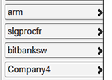
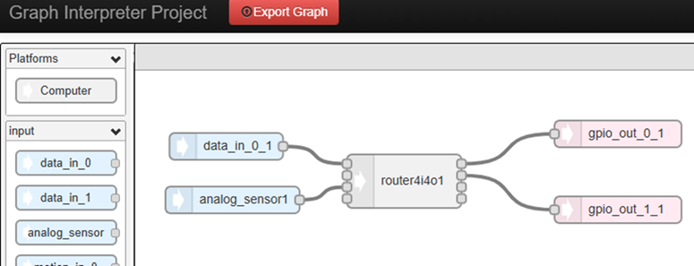
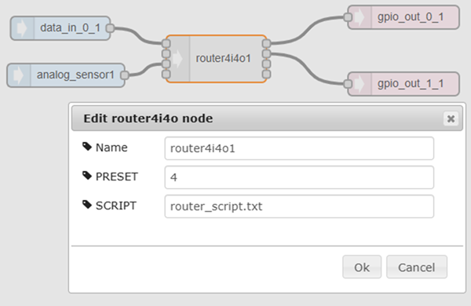
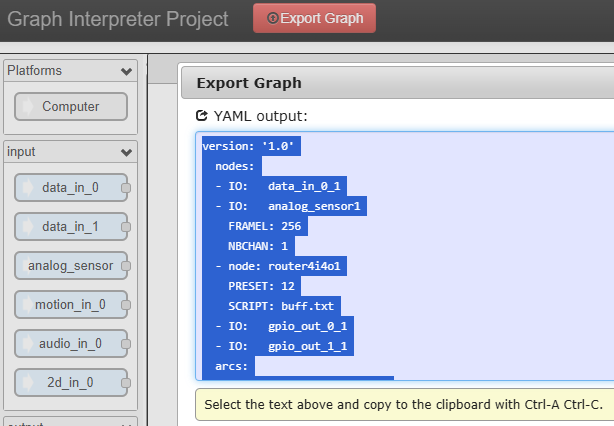

### GUI for NanoGraph

The tool generates a YAML file from a graph designed for a specific platform.

Click on **GUI.html**

The graph is made of nodes, selected from a list of software vendors (right column) :

The tool helps a system integrator designing a stream-based processing graph by connecting the input streams (light blue boxes) to the processing nodes, and the result to output streams (light red boxes) :

Clicking on the boxes allow setting specific parameters ("presets") or more complex descriptions from a file ("scripts") :

Finally, pressing the "Export Graph" button generates the YAML output file used for the graph compilation tool.

### License

The original code is from [Paul Stoffregen](https://github.com/PaulStoffregen/Audio/blob/master/gui/index.html) , modified from original Node-Red source, for audio system visualization. Copyright 2013 IBM Corp. Licensed under the Apache License, Version 2.0 (the "License")
