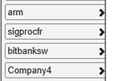
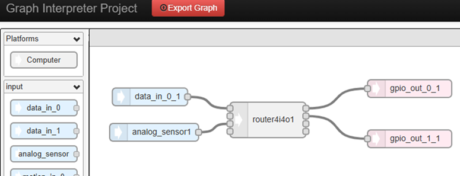
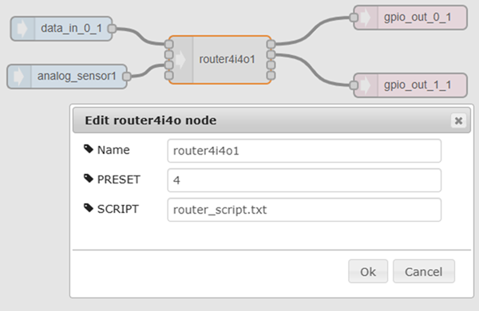
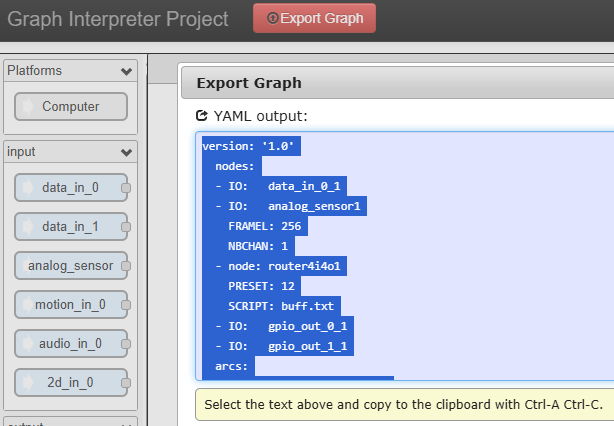

### GUI for NanoGraph

The tool generates a YAML file from a graph designed for a specific platform.

Click on **GUI.html**

The graph is made of nodes, selected from a list of software vendors (right column) :



The tool helps a system integrator designing a stream-based processing graph by connecting the input streams (light blue boxes) to the processing nodes, and the result to output streams (light red boxes) :



Clicking on the boxes allow setting specific parameters ("presets") or more complex descriptions from a file ("scripts") :



Finally, pressing the "Export Graph" button generates the YAML output file used for the graph compilation tool.




### License

The original code is from [Paul Stoffregen](https://github.com/PaulStoffregen/Audio/blob/master/gui/index.html) , modified from original Node-Red source, for audio system visualization. Copyright 2013 IBM Corp. Licensed under the Apache License, Version 2.0 (the "License")

## Platform IO identity and compiler binding

Platform interfaces use two deliberately different indices. `index` is the logical
instance index visible in graph YAML (`io_data_in[0]`, `io_data_in[1]`, ...).
`c_platform_index` is the platform-specific index used by the C implementation and
compiler and is never exported as graph identity. The compiler resolves a graph IO by
`name + index`, then obtains `c_platform_index` and the platform interface format
defaults. Explicit graph format values override platform defaults; otherwise defaults
(such as different sample rates for `io_data_in[0]` and `io_data_in[1]`) are resolved
at compile time rather than copied into every exported arc.

## Export-time format negotiation

Platform and node interface formats are negotiated for each flattened arc during export.
An absent format field is a wildcard (no constraint). If endpoints have a common value,
the exporter selects a concrete compatible value, preferring applicable platform defaults.
If data type or sample rate constraints are genuinely incompatible, export inserts an
automatic `arm_converter_N` node. Its `i_*` parameters describe the producer-side concrete
format and its `o_*` parameters describe the consumer-side concrete format. Compatible
properties are kept identical on both sides so a converter does not perform unnecessary
conversion.

## Exported common formats

Graph export centralizes the resolved stream format of every arc in the top-level
`formats:` section. A numeric `formatID` is generated for each distinct tuple of
`data_type`, `sample_rate`, `nb_channels`, and `interleaving`. Arcs reference the
entry through `formatID`; identical tuples share one format entry.

### Interface format relationship: `same_as`

A node interface may declare that its negotiated stream format is identical
to another interface of the same node:

```yaml
format:
  same_as:
    interface: rx_interface
    index: 0
```

The current negotiated tuple is `data_type`, `sample_rate`, `nb_channels`, and
`interleaving`. Export resolution is order-independent: arcs depending on an
unresolved `same_as` interface are deferred until the referenced interface has
been negotiated.


## FIFO sizing from frame length

`frame_length` is intentionally not part of stream-format negotiation. It describes the processing granularity at each endpoint. During graph export, each arc FIFO is sized independently as:

```text
buffer_size = max(producer frame_length, consumer frame_length)
```

A graph-level IO `framel` value overrides the platform interface frame-length default for that endpoint. For processing nodes, the manifest interface `frame_length.default` is used when present. If only one endpoint has a concrete frame length, that value is used; if neither endpoint does, an existing explicit `buffer_size` is left unchanged. Automatic `arm_converter` insertion preserves the producer frame length on the converter input and the consumer frame length on its output, so the two generated FIFOs are sized separately.


## Importing an exported graph

The GUI provides **Import Graph** next to **Export Graph**. The importer accepts the YAML text emitted by the exporter, either pasted into the dialog or loaded from a `.yaml`, `.yml`, or `.txt` file.

Exports carry `graph_format_version: 1` and `graph_state: resolved`. Nodes inserted automatically by the format resolver carry `generated: true`, `generated_by: format_resolver`, and a `generated_reason`.

The default **Logical import** removes nodes marked `generated: true`, reconnects their single input/output arcs, discards resolved `formatID` values, and lets the current platform/node manifests resolve the graph again on the next export. An `arm_converter` without `generated: true` is considered user-authored and is never removed by this step. **Preserve resolved graph** keeps generated nodes for debugging/reproduction.
