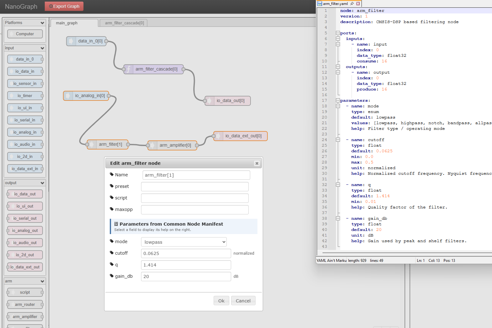

# NanoGraph_Tools

Ultimate goals:

- create the condition for the creation of repositories of precompiled nodes and AI-models, with their documentation ready for AI-agents

- let the product design consists in injecting a YAML description of a graph with scripting commands

  

See documentation 

[here]: https://github.com/llefaucheur/NanoGraph/tree/main/doc

